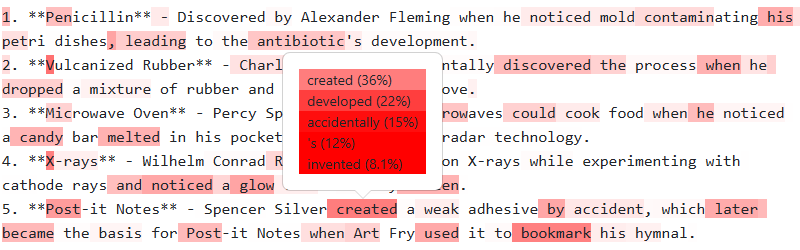
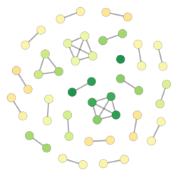
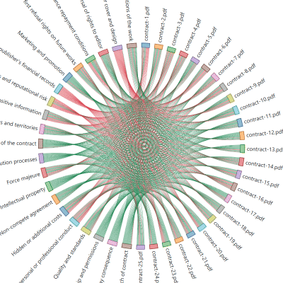

<!-- _backgroundColor: purple -->

# Visualizing LLM Hallucinations

### [Anand S](https://s-anand.net/)

###### LLM Psychologist @ Straive


Slides: [sanand0.github.io/llmhallucinations](https://sanand0.github.io/llmhallucinations)

---


# I'm often asked: What's an LLM psychologist?


I research how LLMs think.

---

# LLMs are more human than machine

Simon Willison:

> One way to think about it is that about 3 years ago, aliens landed on Earth. They handed over a USB stick and then disappeared.
>
> Since then, we’ve been poking the thing they gave us with a stick, trying to figure out what it does and how it works.

---

<!-- _backgroundColor: #212529 -->

## LLMs have biases


Try asking an LLM:

> Pick a random number from 0 - 100.
>
> Write ONLY the number NOTHING ELSE.

Try different `temperature`s.

[llmrandom.straive.app](https://llmrandom.straive.app) 🔗 [](https://github.com/sanand0/llmrandom)

---

<!-- _backgroundColor: #fff -->
<!-- _color: #212529 -->

## LLMs _are_ improving. Hallucinations _are_ reducing


But errors add up in Agents, Computer use.

[LLM Pricing](https://llmpricing.straive.app) 🔗 [](https://github.com/gramener/llmpricing)

---

## Hallucinations can help

<!-- _backgroundColor: #000300 -->


- Penicillin
- Post-it notes
- Pacemakers
- Microwave ovens
- Surrealism / modern art
- Psychedelic Rock
- The Matrix

---

# I check for hallunications in 3 ways

1. **Logprobs**
   LLMs tell you the probability of each word they generate.
   
2. **Embeddings**
   LLMs tell you the numerical closeness of 2 pieces of text.
   
3. **LLM as a judge**
   LLMs don't _often_ make mistakes. Let them cross-check each other.

---

# Logprobs

<!-- _backgroundColor: #fff -->
<!-- _color: #212529 -->


[OpenAI API](https://platform.openai.com/docs/api-reference/chat/create#chat-create-logprobs) gives "logprobs".

```json
{
  "model": "gpt-4o-mini",
  "messages": [...],
  "logprobs": true,
  "top_logprobs": 5
}
```

```json
{ "token": " and", "logprob": -0.018 },
{ "token": " but", "logprob": -4.232 },
```

---

<!-- _backgroundColor: #fff -->
<!-- _color: #212529 -->

# Let's visualize these logprobs

> Concisely list 5 inventions created by human error or hallucinations



[llmviz.straive.app](https://llmviz.straive.app) 🔗 [Prompt](https://llmfoundry.straive.com/playground#?template=Hallucinations) 🔗 [](https://github.com/sanand0/llmviz)

---

<!-- _backgroundColor: #fff -->
<!-- _color: #212529 -->

# Embeddings quantify similarity

[](https://projector.tensorflow.org/)

---

<!-- _backgroundColor: #fff -->
<!-- _color: #212529 -->

# Embeddings highlight hallucinations



Examples:

[What LLMs do marketers use?](https://gramener.com/docsearch/insiderintelligence/)
[What's the Thailand strategy?](https://gramener.com/docsearch/insiderintelligence/)
[What TikTok's Thailand strategy?](https://gramener.com/docsearch/insiderintelligence/)

---



# LLM as a judge

LLMs can evaluate humans and other LLMs.

This works better than embeddings.

For example, which clauses are missing in a contract?

[contractanalysis.straive.app](https://contractanalysis.straive.app) 🔗 [](https://github.com/gramener/contractanalysis)

---

# Summary

<!-- _backgroundColor: purple -->

To check for hallucinations, explore these 3 techniques in order:

|     | Technique            | Cost | Quality |
| :-- | :------------------- | :--- | :------ |
| 1   | Logprobs             | Free | Low     |
| 2   | Embedding similarity | Low  | Medium  |
| 3   | LLM as a judge       | High | High    |

Slides: [sanand0.github.io/llmhallucinations](https://sanand0.github.io/llmhallucinations)


